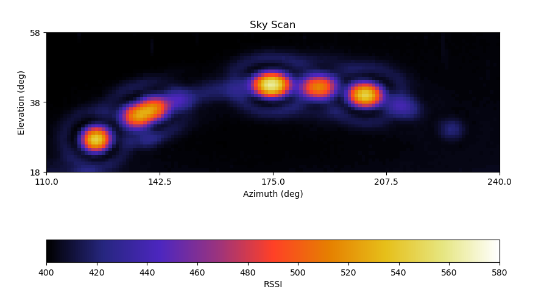
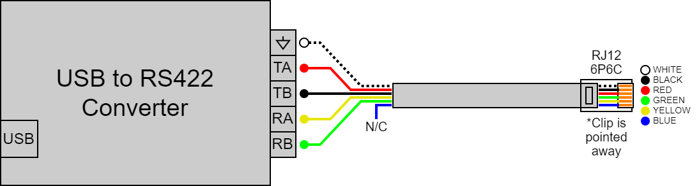
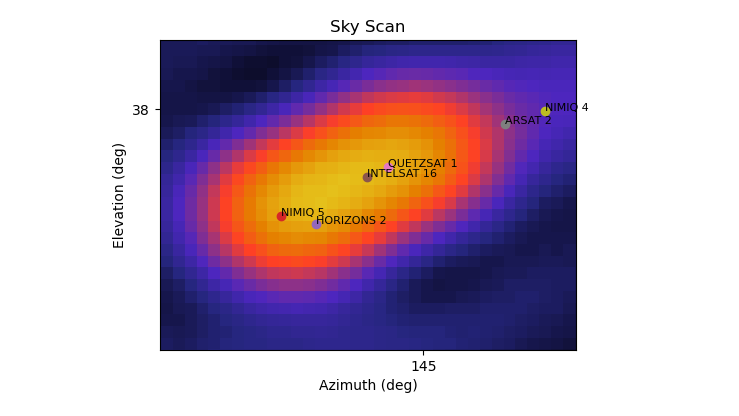

## Introduction

This project utilizes a [Winegard Carryout G2](docs/winegard_g2.png) portable satellite dish
to perform a sky scan and generate a heatmap of satellites in
geosynchronous orbit broadcasting in the Ku band. This project also
enables you to use your portable satellite dish as a rotator to
track satellites across the sky in real time.



## Hardware

A few hardware components are required to connect your computer
to a Winegard G2 satellite dish:

- USB to RS422 converter
- RJ12 6P6C straight wired cable 

Follow the wiring guide below to connect the RJ12 6P6P cable to the
RS422 converter:



| RJ12 WIRE | RS422 PIN     |
|:--------- |:------------- |
| White     | PE / GND      |
| Red       | TA / TX+      |
| Black     | TB / TX-      |
| Yellow    | RA / RX+      |
| Green     | RB / RX-      |
| Blue      | Not Connected |

Note: If your USB to RS422 converter supports multiple TTL levels,
it should be set to 5V.

## Tracker Procedure

Your Winegard G2 portable satellite dish may come pre-configured
to perform a tracker procedure when power is applied. This tracker
procedure must be disabled prior to performing a sky scan.

Follow the instructions outlined in [docs/disable_tracker.md](docs/disable_tracker.md)
to disable this feature.

## Sky Scan

The sky scan will step the dish over each point in the region of
interest at the desired resolution to capture signal strength data.
This data is then displayed in real time on a heatmap which will
be built up over the course of the scan.

The scan resolution can be modified; higher resolution scans will 
produce a higher quality scan image but will take significantly
longer to complete.

Please follow these steps to perform a sky scan:

1) Connect your computer to the RJ12 port via the RS422 converter

2) Apply power to the satellite dish

3) Modify `home.sh` to specify the COM port

4) Execute `./home.sh` to home the azimuth & elevation axes

At this point your dish believes it's pointed due south, but it
could actually be pointed any arbitrary direction. You can correct
this by either of these methods: (A) Physically rotate the dish
assembly until the dish is pointing south or (B) Measure the
offset of the dish from south and supply this value to the script
so it can perform the needed adjustments. Example: If the dish is
pointing to 190 degrees after the homing sequence, the offset would
be -10 degrees.

Note: The stepper motors may interfere with compass readings, so
power should be removed from the satellite dish when taking compass
measurements.

This alignment process only needs to be completed once, as the
homing sequence will produce consistent results each time the dish
is powered up.

5) Modify `skyscan.sh` to specify the COM port, scan parameters,
resolution, and offset angle

Note: The valid elevation range for the Winegard G2 is 18 degrees
to 65 degrees.

6) Execute `./skyscan.sh`

The results of the scan are automatically saved into the scan_data
directory. This includes both a raw data file and the completed
scan image.

## Open Scan File

The raw data file produced by a scan can be re-opened after the
scan is complete. This enables you to interact with the map and
optionally apply an overlay of geostationary satellites:



Follow these steps to open a scan data file:

1) Modify `open.sh` to specify the scan data file

2) Execute `./open.sh`

If you wish to overlay geostationary satellites onto the scan
image, you will need to build an input file for your specific
geographical location. This can be done by adding each satellite
of interest into a real time satellite tracking application
(eg: Gpredict) and recording the azimuth & elevation of the
satellite relative to your location.

Each row of the satellite CSV file consists of:
```
NAME,AZIMUTH,ELEVATION
```

This satellite file can then be specified in `open.sh` along
with the scan data file.

## Rotator Control

You can also use your Winegard G2 portable satellite dish as a
'rotator' along with a real time software application (Eg:
Gpredict) to have it track satellites across the sky in real time. 

Follow these steps to use your dish as a rotator:

1) Modify `rotator.sh` to specify the socket host/port and offset
angle

2) Execute `./rotator.sh`

3) Configure a new rotator in your real time satellite tracking
software (Eg: Gpredict). You can use these settings as a starting
point:
```
Host: localhost
Port: 4533
Az Type: 0deg -> 180deg -> 360deg
Min Az: 60
Max Az: 330
Min El: 18
Max El: 65
Azimuth end stop position: 0
```

Note: The valid elevation range for the Winegard G2 is 18 degrees
to 65 degrees.

4) In the rotator control dialog, select the rotator you just added
and click Engage. When ready, select the target satellite and click
Track.

## Acknowledgements

This project inspired by the saveitforparts YouTube channel:
[https://www.youtube.com/@saveitforparts](https://www.youtube.com/@saveitforparts)
